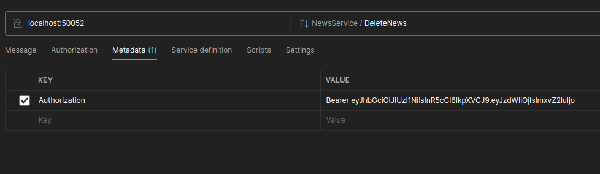

# Что сделано

Реализованы два сервиса, которые общаются между собой по gRPC, соответственно AuthService, содержащий в себе логику по авторизации через refresh/access токены. И сервис NewsService/AdminsService, которые представляют собой gRPC gateway, в тестовую систему, объединены в один, так как у них одна база данных. Также использованы две отдельные базы данных для сервисов

Для отправки запросов к API gRPC необходимо добавить метаданные, где токен это accessToken из ответа логина или регистрации

Или можно воспользоваться подготовленным мною [Воркспейсом постман](https://www.postman.com/spacecraft-geoscientist-12695557/workspace/test-task)

Чтобы получить пользователя админа необходимо изменить роль пользователя в Adminer(адрес - localhost:8085)



## Известные проблемы

<ul>
  <li>Иногда в NestJS ломается RpcExceptionHandler и всегда возвращаются коды UNKNOWN</li>
</ul>

## AuthService

Сервис, реализующий логику авторизации, и доступ к пользователям с пагинацией
Протестировать можно через gRPC в постмане, сгенерировав запрос с тестовыми данными

<ul>
  <li>Используются refresh/access токены</li>
  <li>Есть поддержка обновления токенов</li>
  <li>Поддержка ролей через поле в базе(т.е нет информации о роли в токене)</li>
</ul>

В целом в NestJS приятно делать такие штуки, так как уже есть готовый код и не надо делать велосипед

## NewsService

Сервис, реализующий CRUD с новостями, которые приватные для каждого юзера. С поддержкой двух дополнительных методов, просмотр любого поста и постановка лайка, которые доступны всем пользователям.

<ul>
  <li>Поддежка всех методов задания</li>
  <li>Подсчёт лайков и просмотров</li>
</ul>

## AdminService

Сервис реализующий админку для двух других сервисов, имеют доступ только пользователи с ролью Admin, есть возможность добавить новость и посмотреть пользователей.

## Что бы хотелось сделать, хотя стоило бы

<ul>
  <li>Тесты. Довольно сложно разрабатывать без них сложную логику, где вызовы эндпоинтов зависят друг от друга</li>
  <li>Валидация данных через пайпы или через расширение protobuf, а не в коде метода</li>
</ul>

## FAQ

A: Почему бы не использовать монорепозиторий NestJS?
<br>
Q: Мне не нравится, как он разворачивается в докере, pnpm workspace значительно удобнее, и занимают даже меньше места

A: Почему без редиса?
<br>
Q: Правильное кэширование долго делать ))

A: Зачем руками компилировать protobuf?
<br>
Q: Так они лежат в удобном месте в проекте, и я могу их скопилиовать под любой язык и знаю, что там происходит, да и вообще в NestJS мне не нравятся декораторы микросервисов, с ними сложно засинхрить другой язык ))

A: Зачем GetUsers в AuthService?
<br>
Q: Потому что изначально надо было сделать базу данных пользователей доступную для всех сервисов, создав необходиые роли в PostgreSQL

## Запуск

Ставим зависимости

```
pnpm install
```

Запускаем инфраструктуру

```
docker compose -f docker-compose.dev.yml up
```

Запускаем проект

```
pnpm run dev
```

После чего из постмана можно отправлять запросы к gRPC

<ul>
  <li>localhost:50051 - AuthService</li>
  <li>localhost:50052 - NewsService</li>
  <li>localhost:50053 - AdminService</li>
</ul>
